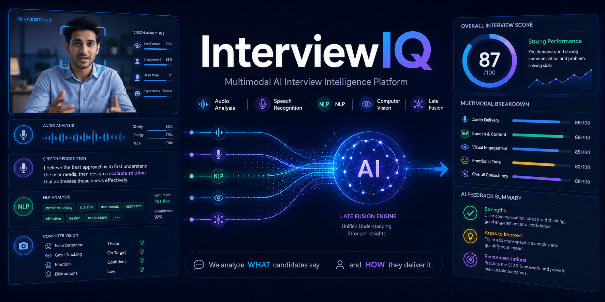

<p align="center">
  
</p>

# 🎯 InterviewIQ — Multimodal AI Interview Intelligence Platform

<p align="center">
  
  
  
  
  
  
  
</p>

**InterviewIQ** is a full-stack AI platform for interview practice and assessment.

It combines **Audio Analysis, Speech Recognition, NLP, Computer Vision, and Multimodal Fusion** to generate structured, evidence-backed interview feedback.

---

## 🚀 Key Features

- 🎙️ Audio and vocal-delivery analysis
- 🗣️ Arabic-capable speech recognition using Faster-Whisper
- 🧠 Technical answer evaluation using semantic retrieval and NLI
- 🔎 BGE-M3 multilingual retrieval
- ⚖️ mDeBERTa-based Natural Language Inference
- 👁️ Computer Vision behavioral analysis
- 🔗 Multimodal Late Fusion
- 📊 Interview reports and history
- 👥 Candidate, Interviewer, Company, and Admin dashboards
- 🏢 Organization, question, user, and invitation management

---

## 🧩 Architecture

```text
Interview Video / Audio
        │
        ├──► Audio Analysis
        │      ├── Emotion Signals
        │      └── Delivery Metrics
        │
        ├──► ASR + NLP
        │      ├── Silero VAD
        │      ├── Faster-Whisper
        │      ├── Claim Decomposition
        │      ├── BGE-M3 Retrieval
        │      └── mDeBERTa NLI
        │
        └──► Vision
               ├── Face Detection
               ├── Visual Behavior
               └── Temporal Analysis

                    ↓
             Evidence Layer
                    ↓
           Multimodal Fusion
                    ↓
           Interview Report
```

---

## 🛠️ Tech Stack

### Frontend
React 18 • Vite • Tailwind CSS • React Router • Axios • Framer Motion • Recharts

### Backend
FastAPI • Uvicorn • SQLAlchemy • Alembic • PostgreSQL • Pydantic • JWT Authentication

### AI & Computer Vision
PyTorch • TorchVision • Transformers • OpenCV • FaceNet-PyTorch

### Speech & NLP
Faster-Whisper • Silero VAD • BGE-M3 • Sentence Transformers • mDeBERTa • PEFT / LoRA

### Audio
Librosa • SoundFile • Transformers • PyTorch

### Testing
Pytest • Pytest-Cov

---

## 🖥️ Platform Interfaces

InterviewIQ includes dedicated interfaces for:

- Candidate Dashboard
- Interviewer Dashboard
- Company Dashboard
- Admin Dashboard
- Interview Room
- Interview Type Selection
- Technical Track Selection
- Processing & Analysis
- Interview Reports
- Interview History
- Organization Management
- User Management
- Question Management
- Invitation Management
- Multimodal Fusion Test Harness

---

## 🧠 Technical Answer Evaluation

```text
Candidate Speech
      ↓
Silero VAD
      ↓
Faster-Whisper ASR
      ↓
Claim Decomposition
      ↓
BGE-M3 Retrieval
      ↓
mDeBERTa NLI
      ↓
Precision + Coverage
      ↓
Technical Score
```

InterviewIQ maps interview questions to reference documents and evaluates candidate claims against supporting evidence.

If sufficient reference evidence is unavailable, the system preserves that state instead of fabricating a score.

---

## 🎙️ Audio Intelligence

Audio analysis includes:

- Speaking rate
- Pause control
- Speech continuity
- Volume stability
- Acoustic emotion analysis
- Evidence sufficiency checks

---

## 👁️ Computer Vision

The Vision subsystem uses:

- OpenCV
- MTCNN / FaceNet-PyTorch
- PyTorch / TorchVision
- Swin Transformer-based modeling
- Temporal behavioral analysis

---

## 🔗 Multimodal Fusion

InterviewIQ follows a **Late Fusion** architecture.

```text
Vision Evidence ─┐
Audio Evidence  ─┼──► Confidence & Evidence Layer ─► Fusion
NLP Evidence    ─┘
```

Each modality is analyzed independently before evidence is combined. Missing or insufficient evidence is explicitly preserved instead of being replaced with fabricated values.

---

## My Contribution

My primary contributions to **InterviewIQ** focused on **Multimodal Fusion** and **Backend Integration**, connecting the AI subsystems with the application workflow.

### Multimodal Fusion

- Integrated outputs from the **Vision, Audio, and NLP** pipelines
- Worked on the **Late Fusion** workflow for combining modality-level evidence
- Connected confidence and evidence signals across AI components
- Preserved missing or insufficient evidence instead of forcing artificial predictions
- Worked on the Fusion testing and integration pipeline

### Backend Integration

- Connected AI analysis components with the **FastAPI backend**
- Integrated model outputs into the interview-processing workflow
- Worked on transferring structured AI results between backend services
- Supported integration between interview analysis, reports, and application interfaces
- Helped bridge the AI modules with the full-stack InterviewIQ platform

---

## 📦 Model & Training Artifacts

Large AI checkpoints and experimental artifacts are stored separately from the GitHub source repository.

They include:

- Vision model checkpoint
- Audio model checkpoint
- NLI / LoRA experiment artifacts
- Training metrics and validation results
- Baseline comparison reports
- SHA-256 artifact manifest

**Large model artifacts are stored separately and are not included in the public repository.**

---

## ⚠️ Current Development Status

- The candidate workflow runs real Audio, ASR, and NLP analysis.
- The standalone Fusion harness runs real Vision, Audio, and NLP pipelines together.
- Full persisted production cross-modal Fusion is still under development.
- Experimental models must pass evaluation gates before promotion.
- Legacy mock-analysis code remains in the repository but is not the target production architecture.

---

## 📂 Project Structure

```text
InterviewIQ/
├── frontend/
├── backend/
├── InterviewIQ_AI/
│   ├── audio/
│   ├── nlp/
│   ├── vision/
│   └── fusion/
├── nginx/
├── poster/
└── docker-compose.yml
```

---

## 🎯 Project Goal

InterviewIQ aims to transform interview recordings into **traceable, evidence-backed feedback** that evaluates both:

1. **What the candidate said**
2. **How the candidate delivered it**

The system is designed around explainability, modality-level evidence, confidence, and explicit handling of insufficient data.

---

## 📌 Project Status

🚧 **Active Development** • Graduation Project • AI Engineering Portfolio
